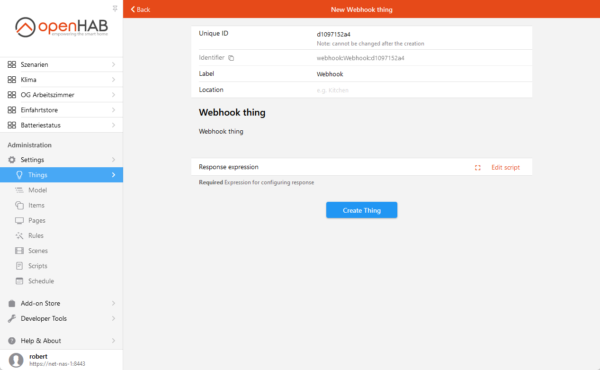
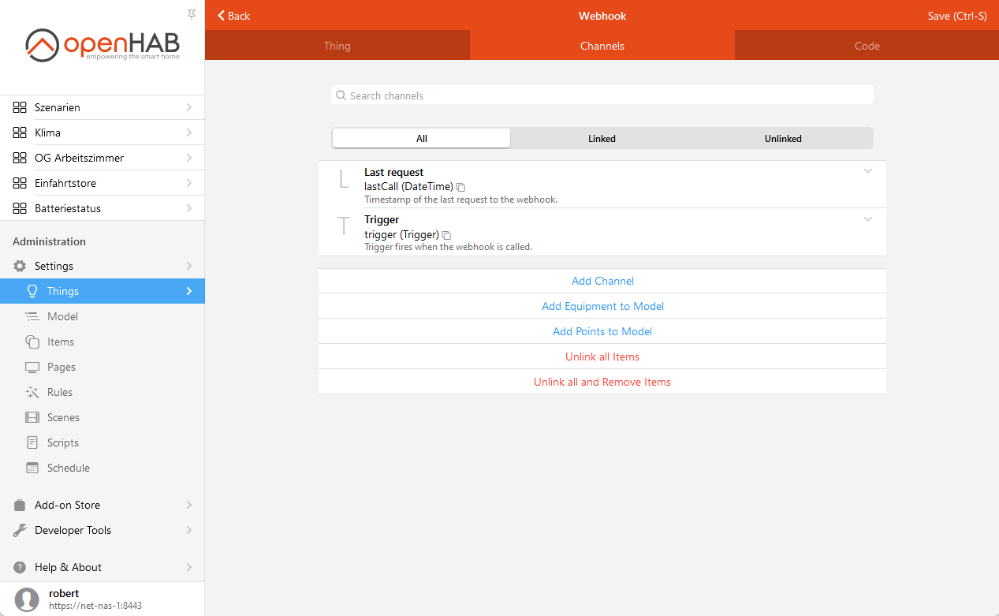

# openHAB for Garmin

**openHAB for Garmin** connects your Garmin wearable to your [openHAB](https://www.openhab.org) smart home system, giving you convenient access to essential devices and real-time information.

➡️ [Install on Garmin Connect IQ Store](https://apps.garmin.com/apps/93fd8044-1cf4-450c-b8aa-1c80a6730d1a)

---

## 📖 Table of Contents

🧰 [Resources](#-resources)

🚧 [Development Status](#-development-status)

🌐 [Connectivity](#-connectivity)

⚙️ [Configuration](#️-configuration)

🔐 [Using myopenHAB](#-using-myopenhab)

🧭 [Sitemap Features](#-sitemap-setup)

🛠️ [Custom Webhook](#️-custom-webhook)

🚨 [Troubleshooting](#-troubleshooting)

📄 [License](#-license)

---

## 🧰 Resources

- 💬 [openHAB Community Discussion](https://community.openhab.org/t/openhab-for-garmin/163891)  
- 🐞 [Report Issues on GitHub](https://github.com/TheNinth7/ohg/issues)

---

## 🚧 Development Status

⚠️ This app is in an **early stage of development**. Core features are available, and active development is ongoing.

### ✅ Current Features
- Display a single openHAB sitemap
- View frames and switch elements
- Monitor switch status
- Control (toggle) switches via custom Webhook

### 📋 Planned Features
- Support for additional sitemap element types
- Command support via openHAB REST API
- Multi-sitemap and multi-server support

---

## 🌐 Connectivity

Garmin wearables rely on your smartphone for network access. If your phone can reach your openHAB instance (e.g. via local network or VPN like Tailscale), the watch can too.

### Platform-specific Limitations
- **iOS**: HTTP and HTTPS supported  
- **Android**: Only HTTPS with a valid certificate is supported due to Garmin SDK limitations

You can use [myopenHAB](https://www.myopenhab.org) to securely access your local openHAB instance over the Internet using HTTPS.

---

## ⚙️ Configuration

After installing the app, the following settings are available:

| Setting             | Description |
|---------------------|-------------|
| **URL**             | Your openHAB URL in the format `https://host:port` or `http://host:port`. Note: HTTP only works with iOS. See [Connectivity](#connectivity) for details. |
| **Sitemap Name** | Name of the sitemap to display. See [Sitemap Setup](#-sitemap-setup) for details. | 
| **Webhook Identifier** | Required to send commands. Without it, the app can only display item states. See [Custom Webhook](#custom-webhook). |
| **Username**        | For basic authentication (used for [myopenHAB](#-using-myopenhab), see below) |
| **Password**        | Password for basic authentication |
| **Polling Interval (ms)** | Interval between data requests to your openHAB instance. Set to 0 to fetch new data immediately after the previous response is processed. **Note:** When using **myopenhab.org**, it’s recommended to use the default (3000 ms) or a higher value. Lower intervals may trigger errors due to rate limiting by myopenhab.org. |


---

## 🔐 Using myopenHAB

To connect using [myopenHAB](https://myopenhab.org):

1. Install the [openHAB Cloud Connector](https://www.openhab.org/addons/integrations/openhabcloud/)
2. Register at [myopenhab.org](https://myopenhab.org)
3. Set the URL in the app to `https://home.myopenhab.org`
4. Use your myopenHAB username and password for authentication

---

## 🧭 Sitemap Setup

The app uses your openHAB sitemap to determine the structure of the app's interface.  
📘 [openHAB Sitemaps Documentation](https://www.openhab.org/docs/ui/sitemaps.html)

### Sitemap Definition

The sitemap name configured in the app must match the filename of the sitemap, excluding the `.sitemap` extension.

For example, if the file is named `garmin_demo.sitemap`, set the sitemap name in the app settings to `garmin_demo`.

The label defined within the sitemap file is displayed in the app UI, such as in glances and other views.

```xtend
sitemap garmin_demo label="My Home" {
}
```

<table>
  <tr>
    <td width="50%"></td>
    <td></td>
  </tr>
</table>

### Supported Elements

Currently supported element types and parameters:
- [`Frame`](https://www.openhab.org/docs/ui/sitemaps.html#element-type-frame)
  - `label`

- [`Switch`](https://www.openhab.org/docs/ui/sitemaps.html#element-type-switch) linked to [Switch items](https://www.openhab.org/docs/configuration/items.html)
- `label`
- `item`

- [`Text`](https://www.openhab.org/docs/ui/sitemaps.html#element-type-text)
  - `label`
  - `item`

### Example Sitemap

```xtend
sitemap garmin_demo label="My Home" {
	Frame label="Entrance Gates" {
		Switch item=EntranceGatesTrigger label="Open/Close"
		Text item=EntranceGateStatus label="Status"
	}
	Frame label="Ground Floor" {
		Switch item=LightCouch label="Couch Light"
	}
	Frame label="First Floor" icon="folder" {
		Switch item=LightBedroom label="Bedroom Light"
		Switch item=LightStudy label="Study Light"
		Switch item=LightGallery label="Gallery Light"
	}
}
```
This configuration produces the following display in the UI:
<table>
  <tr>
    <td width="50%"></td>
    <td></td>
  </tr>
  <tr>
    <td width="50%"></td>
    <td></td>
  </tr>
</table>

---

## 🛠️ Custom Webhook

The current openHAB REST API does not work with Garmin SDK. This will change in a future openHAB release ([details](https://github.com/openhab/openhab-core/pull/4760)).

Until then, you can set up a custom Webhook:

### 1. Install the Webhook Binding

Install the [Webhook HTTP binding](https://community.openhab.org/t/webhook-http-binding/152184).


---

### 2. Create a Webhook Thing

Create a new Webhook Thing.



Go to the **Code** tab and enter the following YAML (replace `UID` with your own):

```yaml
UID: webhook:Webhook:d1097152a4
label: Webhook
thingTypeUID: webhook:Webhook
configuration:
  expression: resp.status=200
channels:
  - id: lastCall
    channelTypeUID: webhook:lastCall-channel
    label: Last request
    configuration: {}
  - id: trigger
    channelTypeUID: webhook:trigger-channel
    label: Trigger
    configuration:
      expression: >-
        {
          var gson = new("com.google.gson.Gson");
          var jsonRoot = {:}; var jsonBody = {:};
          if (!empty(req.body.text)) jsonBody.put("text", req.body.text);
          if (!empty(req.body.json)) jsonBody.put("json", req.body.json);
          jsonRoot.put("parameters", req.parameters);
          jsonRoot.put("body", jsonBody);
          jsonRoot.put("method", req.method);
          return gson.toJson(jsonRoot);
        }
```



---

### 3. Create a Rule with JavaScript

Create a [Rule](https://www.openhab.org/docs/concepts/rules.html) that triggers on webhook and runs this JavaScript:

```javascript
var request = JSON.parse(event.event);

var action = request.parameters.action?.[0] ?? null;
var itemName = request.parameters.itemName?.[0] ?? null;
var command = request.parameters.command?.[0] ?? null;

if (action === "sendCommand") {
  if (itemName && command) {
    items.getItem(itemName).sendCommand(command);
  } else {
    console.warn(`Webhook: sendCommand missing parameters (itemName='${itemName}', command='${command}')`);
  }
} else if (action === "toggle") {
  if (itemName) {
    var item = items.getItem(itemName);
    item.sendCommand(item.state === "ON" ? "OFF" : "ON");
  } else {
    console.warn(`Webhook: toggle missing itemName`);
  }
} else {
  console.warn(`Webhook: invalid or missing action '${action}'`);
}
```

| Parameter | Description |
|-----------|-------------|
| `action`  | `"sendCommand"` or `"toggle"` |
| `itemName` | Name of the item to control |
| `command`  | Command to send (for `sendCommand`) |

---

### 4. Test & Connect

You can test the webhook by visiting:

```
https://yourserver:yourport/webhook/d1097152a4?action=toggle&itemName=LightBedroom
```

Then enter the Webhook ID (`d1097152a4`) in the app settings:


---

## 🚨 Troubleshooting

This section explains how the app handles errors and lists common issues you might encounter.

### How the App Handles Errors

The app distinguishes between **temporary (non-fatal)** and **critical (fatal)** errors:

* **Non-fatal errors** trigger a toast notification at the top of the screen, allowing you to continue using the app.
* **Fatal errors** display a full-screen error view, halting further use until the issue is resolved.

**Non-fatal errors include:**

* Most communication-related issues when requesting the sitemap.
* All communication-related issues when sending a command.

> Note: Non-fatal errors related to requesting the sitemap will become fatal if they persist for more than 10 seconds.

**Immediately fatal errors include:**

* Certain communication errors when requesting the sitemap, specifically:

  * Error `-1001` (see below)
  * HTTP error `404`
* Errors encountered while parsing the sitemap.
* Any other unexpected errors or exceptions.

> Note: Even after a fatal error, the app continues querying the sitemap. If a response is successfully processed, it returns to displaying the sitemap.

---

### Communication Error Codes

To save space, communication errors shown in toast notifications follow this format:

`X:NNNNNN`

* `X` indicates the source of the error:

  * `S` = sitemap polling
  * `C` = command sending
* `NNNNNN` is the error code:

  * Positive values = HTTP status codes
  * Negative values = Garmin SDK error codes

For a full list of Garmin SDK error codes, see the **Constant Summary** section here:
👉 [Garmin Communications API Docs](https://developer.garmin.com/connect-iq/api-docs/Toybox/Communications.html)

**Special error codes:**

The following error codes are used for common communication issues and those without specific error codes:

* `NO PHONE` – The watch is not connected to the smartphone (= -104 or -2).
* `INVRES` – The response was invalid (= -400).
* `EMRES` – The response was empty.

---

### Common Issues

| Error | Description |
| ----- | ----------- |
| `S:EMRES/myopenHAB` | myopenHAB currently has an intermittent issue where sitemap requests may return empty responses. The app will show a non-fatal `S:EMRES` notification. Usually, the next request succeeds, preventing escalation to a fatal error. [More info](https://github.com/openhab/openhab-cloud/issues/496) |

---

## 📄 License

MIT License

Copyright (c) 2025 Robert Pollai

Permission is hereby granted, free of charge, to any person obtaining a copy
of this software and associated documentation files (the "Software"), to deal
in the Software without restriction, including without limitation the rights
to use, copy, modify, merge, publish, distribute, sublicense, and/or sell
copies of the Software, and to permit persons to whom the Software is
furnished to do so, subject to the following conditions:

The above copyright notice and this permission notice shall be included in all
copies or substantial portions of the Software.

THE SOFTWARE IS PROVIDED "AS IS", WITHOUT WARRANTY OF ANY KIND, EXPRESS OR
IMPLIED, INCLUDING BUT NOT LIMITED TO THE WARRANTIES OF MERCHANTABILITY,
FITNESS FOR A PARTICULAR PURPOSE AND NONINFRINGEMENT. IN NO EVENT SHALL THE
AUTHORS OR COPYRIGHT HOLDERS BE LIABLE FOR ANY CLAIM, DAMAGES OR OTHER
LIABILITY, WHETHER IN AN ACTION OF CONTRACT, TORT OR OTHERWISE, ARISING FROM,
OUT OF OR IN CONNECTION WITH THE SOFTWARE OR THE USE OR OTHER DEALINGS IN THE
SOFTWARE.

---
